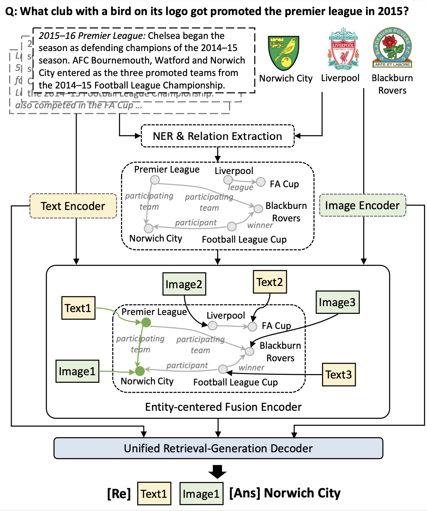
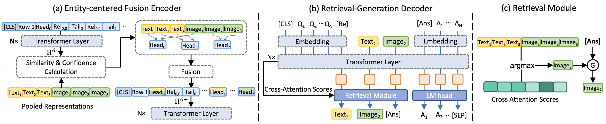

# Enhancing Multi-modal Multi-hop Question Answering via Structured Knowledge and Unified Retrieval-Generation

## Introduction

This repository contains the source code necessary to reproduce the results presented in our ACM MM 2023 paper titled ["Enhancing
Multi-modal Multi-hop Question Answering via Structured Knowledge and Unified Retrieval-Generation"](https://arxiv.org/abs/2212.08632).
The research focuses on improving multi-modal multi-hop question answering through the use of structured knowledge and a
unified retrieval-generation approach.





## Training procedure

We conducted experiments using two datasets: MultimodalQA and WebQA. To reproduce the experiments, you will need to
download these datasets from the following sources:

- [MultimodalQA](https://github.com/allenai/multimodalqa)
- [WebQA](https://github.com/WebQnA/WebQA).

Our model is based on two pre-trained models: [OFA-base](https://huggingface.co/OFA-Sys/ofa-base)
and [BART-base](https://huggingface.co/facebook/bart-base). Please download these models and update the following
parameters in the code to their respective paths:
Please download these models and update the following parameters in the code to their respective paths:

- ``model_name_or_path``: Path to OFA-base model
- ``bart_model_name_or_path``: Path to BART-base model

Note that OFA-base and Bart-base use the same tokenizer, so we employ OFA-base tokenizer for both training and testing.

### Squad pre-training

We pre-train OFA and BART on [SQUAD 2.0](https://rajpurkar.github.io/SQuAD-explorer/) dataset.
To pre-train BART on Squad, please download the dataset and run the following command:

```
python ./OFA/run_bart_squad.py --example_file_train path-to-SQUAD-train-set --example_file_eval path-to-SQUAD-eval-set --bart_model_name_or_path path-to-bart-base --model_name_or_path path-to-ofa-base --output_dir  output-directory
```

OFA-base is pre-trained in a similar way using ```run_bart_squad.py```. Note that we only utilize the encoder of
OFA-base for image encoding.

### Knowledge graph construction

#### Entity extraction

For entity extraction, we use
the [ELMo-based NER](https://demo.allennlp.org/named-entity-recognition/named-entity-recognition) tool to extract
entities from the input sources.
Additionally, we evaluate our method based on different information extraction tools.
Please follow the instructions of the respective tools and save the entities as a dictionary with the following format:

```
{ID : {'title': [entity1, entity2,...],'facts': [entity1, entity2,...]}}
```

Here, `ID` represents the sample ID, `title` refers to the head entities in the title, and `facts` refers to the tail
entities in the facts.

#### Relation extraction

To perform relation extraction, we use Coreference Resolution (e.g., [F-Coref](https://huggingface.co/biu-nlp/f-coref))
on facts for more accurate results.
The results are saved as a dictionary with the format:

```
{ID : corresponding fact using Coreference Resolution}
```

After performing Coreference Resolution, we extract relations using various methods and compare their performance.
The following code demonstrates how to use [OpenNRE](https://github.com/thunlp/OpenNRE) for relation extraction.
Please install it before proceeding with relation extraction.
Here's an example for extracting relations on the WebQA test set, making sure to update the corresponding file paths in
the python file::

```
python ./event_extraction/get_opennre_relation_test.py 
```

The extracted relations will be saved as a dictionary with the following format:

```
{ID: {head entity:{tail entity: relation}}}
```

#### Align sources to KG and linearize

Below are the examples for obtaining alignment and linearized KGs. Please ensure to update the corresponding file paths
in the Python file before running the commands.

To align sources to the extracted KG and linearize the KG on the WebQA test set, execute the following command:

```
python ./event_extraction/opennre2table_webqa_test.py 
```

The alignment between sources to head entities, the linearized KG, and the span of each head entity in the linearized KG
will be saved as dictionaries in *pkl* files.

For MultimodalQA, you can obtain the tokenized IDs and masks of texts, tables, and images by running:

```
python ./OFA/datasets/preprocess/build_mmqa_dataset_dict.py 
```

Then, to get the alignment between sources and cells of the given table in MultimodalQA, run the following command:

```
python ./event_extraction/get_mmqa_table_alignment.py 

```

To obtain the spans of cells in the linearized table in MultimodalQA, use the following command:

```
python ./event_extraction/get_mmqa_table_spans.py 
```

#### Image feature extraction

Following the procedure described in [OFA-base](https://huggingface.co/OFA-Sys/ofa-base), we need to get the patch
feature of images first.
For example, to get the image features of the WebQA test set, download the features of WebQA and run:

```
python ./OFA/datasets/preprocess/get_image_feat_webqa_test.py 
```

Before running the command, ensure to update the corresponding file paths in the Python file.
The image features will be saved as individual *pkl* files in the same folder.

### Training

To train the SKURG on MultimodalQA, you can use the following command as an example.
Ensure to update the corresponding file paths:

```
python ./OFA/run_SKURG_mmqa.py --do_train --output_dir output-path
```

The checkpoints will be saved in the specified *output_dir*.

The training procedure for WebQA is similar to MultimodalQA, but you need to
install [BARTScore](https://github.com/neulab/BARTScore) for evaluation.
Use the following command to train the SKURAG model on WebQA:

```
python ./OFA/run_SKURG_webqa.py --do_train --output_dir output-path
```

Please make sure to update the necessary file paths and any other configurations required for successful training.

## Testing

To run a trained model on the MultimodalQA validation set, use the following command:

```
python ./OFA/run_SKURG_mmqa.py --do_eval --eval_model_name_or_path path_to_ckpt
```

Replace *path_to_ckpt* with the path to the trained checkpoint of the SKURAG model. All generated answers and a text log
will be saved in the specified output directory.

After generating the answers, you can evaluate the Exact Match (EM) and F1 scores of the generated answers using the
following command:

```
python ./OFA/utils/cal_EM_F1.py
```

Make sure to change the path to the generated file to calculate the evaluation scores accurately.

Similarly, to test the result on the validation set of WebQA, use the following command:

```
python ./OFA/utils/calScore_webqa_baseline.py
```

## Results

The output results, including generated answers and predicted evidence, for both MultimodalQA and WebQA validation sets
can be downloaded from
the [Google Drive](https://drive.google.com/drive/folders/15hwQNY3O4yeSJFvDT8CrxihdIpX6EQlf?usp=sharing).
You can also find the the checkpoints for both datasets in this link.
Please note that the results in the paper may not identically correspond to the results in the provided links above, as
multiple models were trained, and we used the average score to present the qualitative results in the paper.

## Framework versions

The code was developed and tested with the following framework versions:

* Pytorch 1.7.1+cu110
* Transformers 4.18.0

## Citation

```
@inproceedings{10.1145/3581783.3611964,
author = {Yang, Qian and Chen, Qian and Wang, Wen and Hu, Baotian and Zhang, Min},
title = {Enhancing Multi-Modal Multi-Hop Question Answering via Structured Knowledge and Unified Retrieval-Generation},
year = {2023},
booktitle = {Proceedings of the 31st ACM International Conference on Multimedia},
pages = {5223–5234},
numpages = {12},
location = {Ottawa ON, Canada},
series = {MM '23}
}
```

## License

This repository respects to Apache License 2.0.
